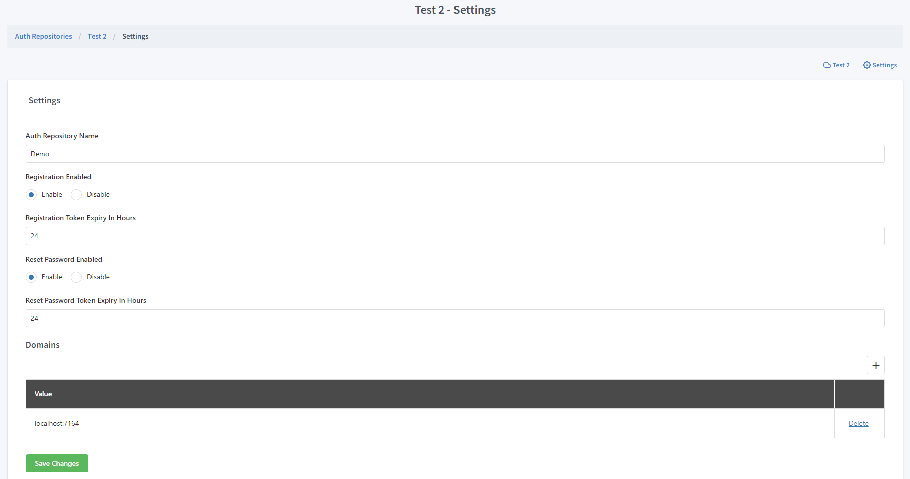

Auth Repository Dashboard
==========================

Repositories are one of the CreateAnAPI Core resources, which is specialized database table that holds user login information. 

New Auth Repository
--------------------

You can create a new auth repository for an account in CreateAnAPI Admin.

Auth Repository Name
""""""""""""""""""""""""

Auth Repository names are only used for users to identify the repository, it does not have any programatic impact and can be changed at any moment.

Domains
""""""""""""""""""""""""

The domains of the authentication repository. 