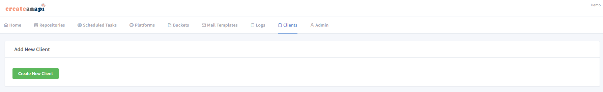

API Clients
========================

Account based api clients are created from CreateAnAPI Admin. 
The created api key will work on all CreateAnAPI resources (Core API, Supplier Index API, etc) if the account has the resource assignments.

.. Attention:: This api key only lets consumer to access the resources. For platforms logins, OIDC Client should be created in CreateAnAPI Admin platform section.

