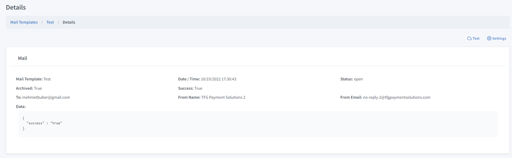
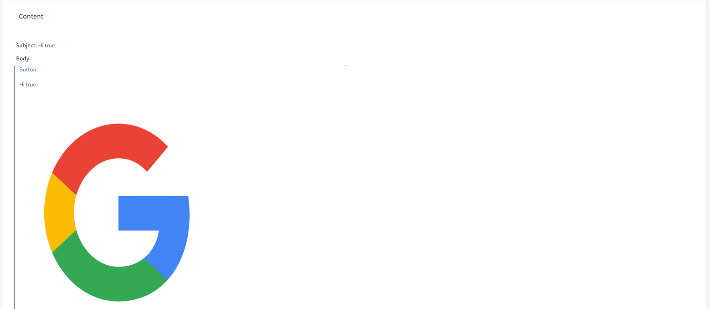
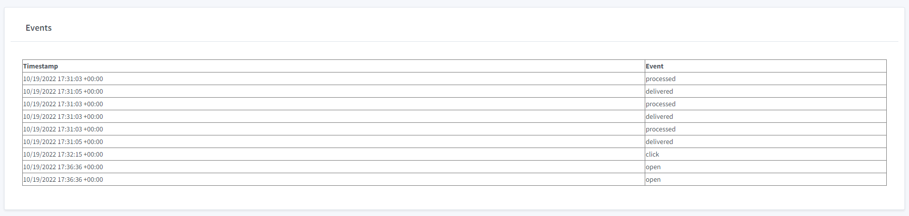

Mail Details
==============

To
""""""""""

Email to address

From
""""""""""

Email from address

Status
""""""""""

Last received webhook event from SendGrid.

Create Date
""""""""""""

The date of mail request.

Archived
""""""""""

Shows if the mail is archived or not. If true, system will not attempt to send the mail.

Success
""""""""""

Shows if the mail is archived or not. Success is true when mail sent successfully.

Attempt
""""""""""
Shows the number of attempts to send an email. If the mail does not succeed 3 times, it will be archived.

Subject
""""""""""
The subject of the sent email

Body
""""""""""
The content of the sent email

Event
""""""""""
The event code received from SendGrid Webhook

Timestamp
""""""""""
The date of the event

Delivery Events
""""""""""""""""

* Processed
* Dropped
* Delivered
* Deferred
* Bounce
* Blocked

Engagement Events
""""""""""""""""""
* Open
* Click
* Spam Report	
* Unsubscribe
* Group Unsubscribe	
* Group Resubscribe	

Detailed information
""""""""""""""""""""""""

https://docs.sendgrid.com/for-developers/tracking-events