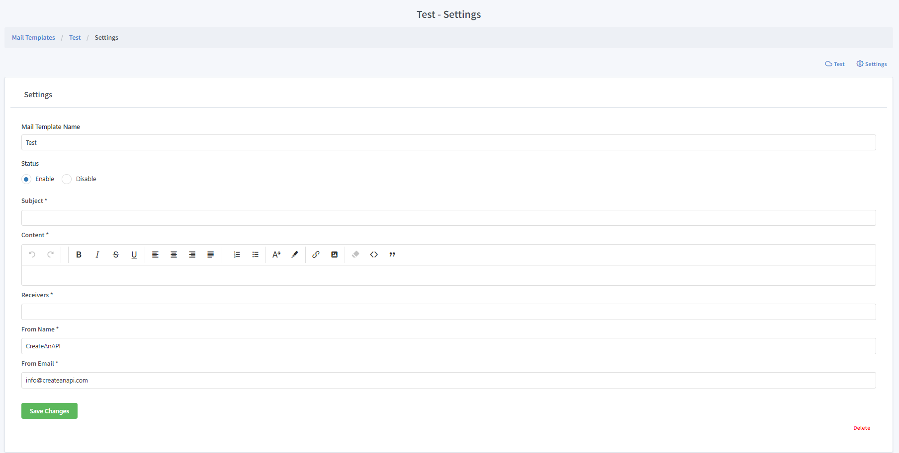

New Mail
==============

Name
""""""""""""

The name of the mail template. Not used in any programmatic process. Can be changed any time.

Status
""""""""""""

Determines if the mail queue is active or not. If disabled, mails will be queued but not send.

Subject
""""""""""""

The subject of the mail. Dynamic strings ({{name}}, {{last_name}} etc.) can be used in the subject.

Content
""""""""""""

The subject of the mail. Dynamic strings ({{name}}, {{last_name}} etc.) can be used in the subject.

.. Attention:: Highlight all dynamic text while styling. If dynamic text highlighted partially, replace method will not work.

Receivers
""""""""""""

Comma seperated list of mail receivers. 

.. Hint:: Receivers also can be added via PostMail request dynamically.

From Name
""""""""""""

From name of the email.

From Email
""""""""""""

From email of the email. 

.. Attention:: Must be a createanapi.com predefined e-mail address or a custom domain for an account.

