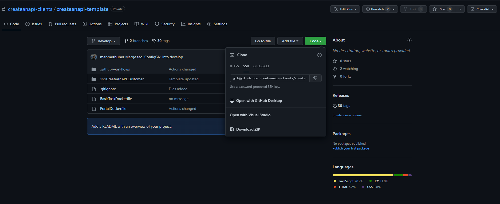
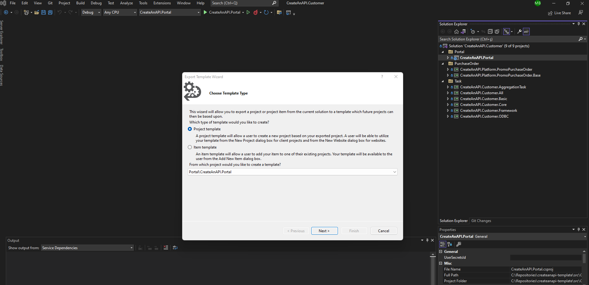
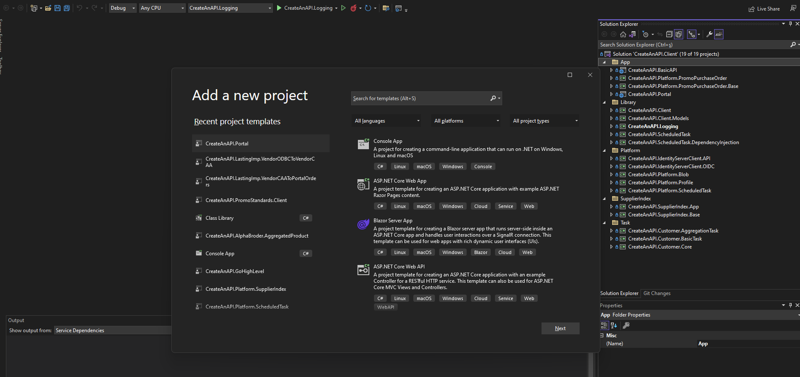
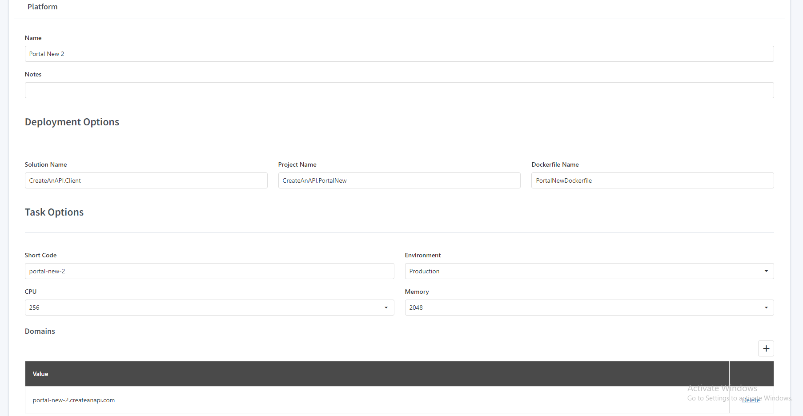
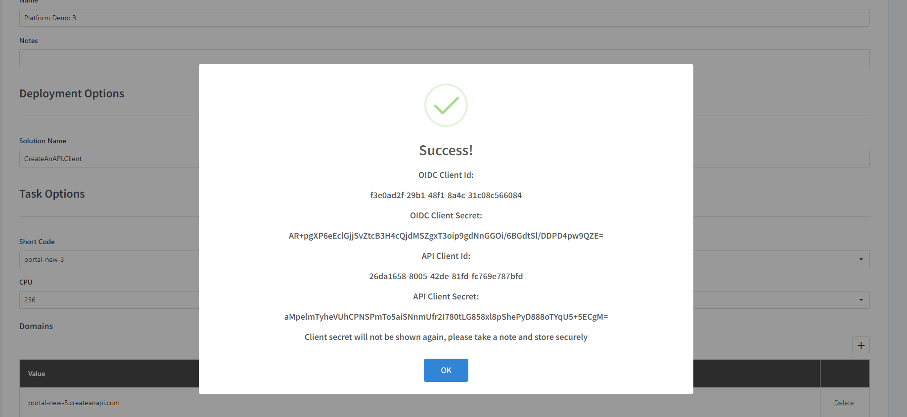
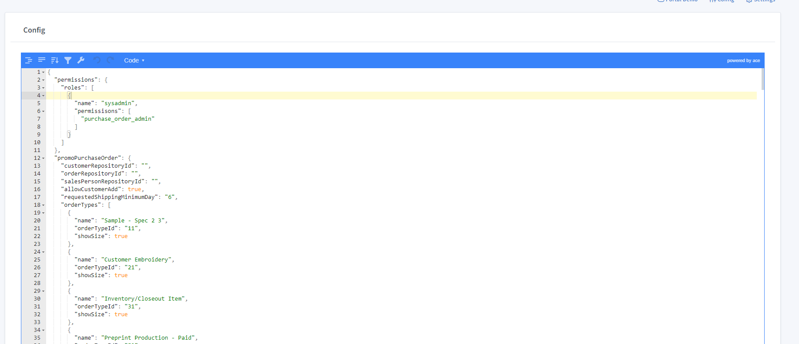
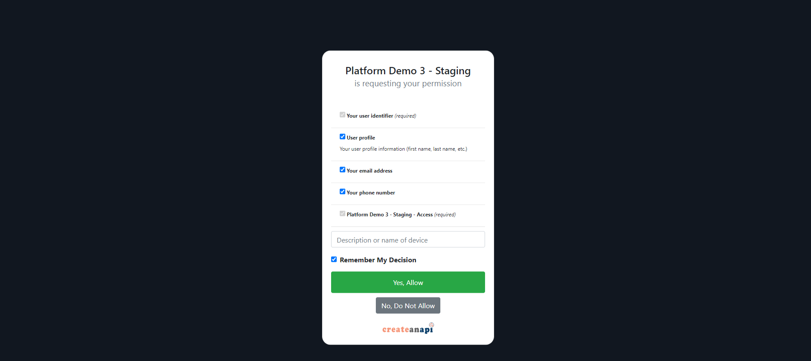
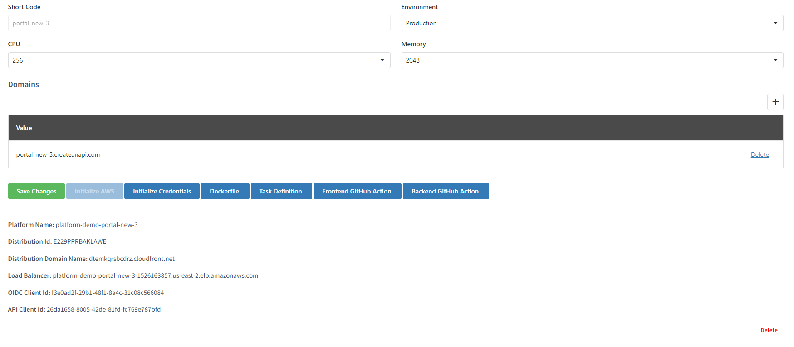
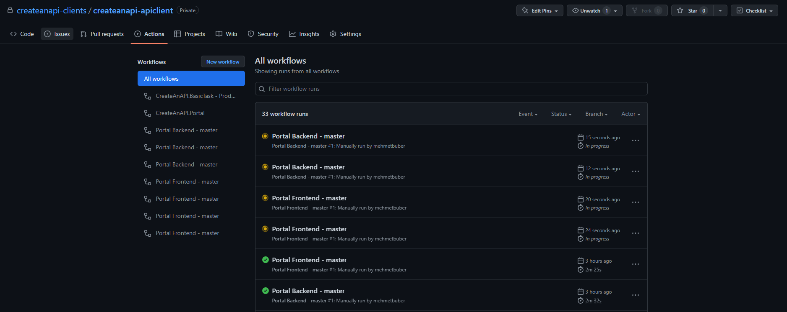

New B2B Portal
==============

This section of the documentation details the public API
usable to get details of projects, builds, versions and other details
from Read the Docs.

Template
------------------------------

Pull latest master template
------------------------------

* https://github.com/createanapi-clients/createanapi-template
* Pull the repository to local
* Switch to master branch

Export projects as a new template
---------------------------------

* Create template from .Net Projects
* https://github.com/createanapi-clients/createanapi-template/tree/master/src/CreateAnAPI.Customer/CreateAnAPI.Portal

Local
------------------------------

Create portal solution & project
---------------------------------

* Create a new GitHub repository for customer if does not exist
* Create a new solution for customer if does not exist -> src/{{SOLUTION_NAME}}
* Create a new project from template -> src/{{SOLUTION_NAME}}/{{PROJECT_NAME}}

Create Platform in CreateAnAPI Admin (Production and Staging)
-------------------------------------------------------------

* Create platforms with
* ShortCode
* Solution Name
* Project Name
* Dockerfile Name
* App urls

Initialize credentials
------------------------------

* Update appconfig with credentials and platform id

Create initial config
------------------------------

Build & Start Project
------------------------------

* Environment should be 'LocalStaging' or 'LocalProduction'
* src/{{SOLUTION_NAME}}/{{PROJECT_NAME}}/Properties/launchSettings.json
* Always use {{PROJECT_NAME}} launch profile, not IISExpress
* Always use https://localhost:5004/

`yarn install`
`yarn start`
`dotnet run`

Publish
------------------------------

Initialize AWS
------------------------------

Download Dockerfile, GitHub Actions and Task Definition
-------------------------------------------------------

* /{{DOCKERFILE_NAME}}
* /src/{{SOLUTION_NAME}}/{{PROJECT_NAME}}
* /.github/workflows/{{SHORTCODE}}-github-action-backend.yml
* /.github/workflows/{{SHORTCODE}}-github-action-frontend.yml

Create Staging and Production Route53 Records
-------------------------------------------------------

https://us-east-1.console.aws.amazon.com/route53/home?region=us-east-2#

Publish Staging and Production
------------------------------

https://github.com/createanapi-clients/createanapi-template/actions

