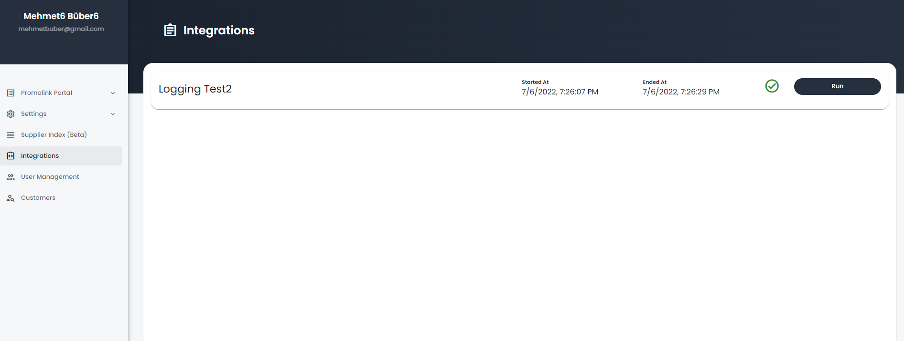

Task Management
===============

This section of the documentation details the public API
usable to get details of projects, builds, versions and other details
from Read the Docs.

Enables the end user to trigger the tasks. 

Nuget Package
-----------------

CreateAnAPI.Platform.TaskManagement

Startup.cs
-----------------

.. code-block:: csharp
   :linenos:

    services.AddMvc()
    .AddTaskManagement(Configuration);

appconfig.json
-----------------

.. code-block:: json
   :linenos:

    {
        "TaskManagement": {
            "Tasks": {
            "TotalCount": 1,
            "Items": [
                {
                "Id": "62bf42922c68cc8d86278700",
                "Name": "Logging Test2",
                "Description": "Basic logging task"
                }
            ] 
            }
        }
    }