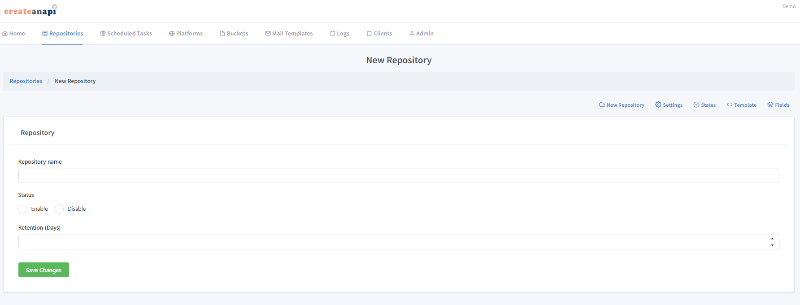
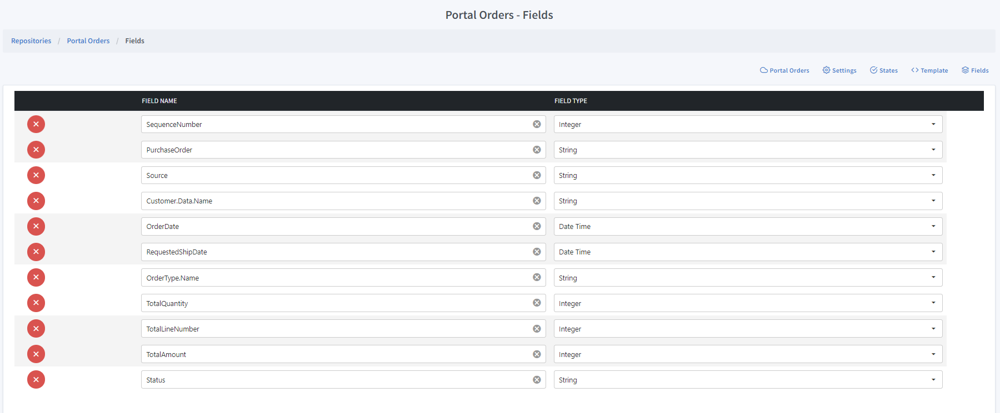

Repository Dashboard
====================

Repositories are one of the CreateAnAPI Core resources, which is equivalent of a Database Table. 

New Repository
--------------

You can create a new repository for an account in CreateAnAPI Admin.

Repository Name
""""""""""""""""""

Repository names are only used for users to identify the repository, it does not have any programatic impact and can be changed at any moment.

Repository State
""""""""""""""""""

Repository state enabled / disables the crud operations on the repository. Should be enabled for active solutions.

Repository Retention
""""""""""""""""""""

.. Attention:: Retentions will be deprecated in a future version.

Repository retention is the number of days the data should be kept in the repository. After the retention days have passed for a given data, the data will be removed from the repository. You can set the retention as ``-1`` to disable retention.

.. Warning:: Please be aware of the retention. If set less than desired, you may risk losing the data after given period.

Repository Template
""""""""""""""""""""

Predefined list of fields. If there are two fields with the same name defined in the template and the repository, the priority goes to the repository's field.

Repository Fields
-----------------

Any field that needs to be queried or aggregated should be included in the field definitions of a repository.

There are 6 types of fields that are currently supported. ``Integer``, ``String``, ``Decimal``, ``Bool``, ``DateTime``, ``Tags (array of strings)``.

You can also set nested fields like ``parent.child`` to be queried.

Fields are only required for query operations, data can have other fields than the definition, however additional fields cannot be queried until they are defined in the data.

.. Attention:: If you decide to change or add a new field after the repository contains data, for the fields that needs to be parsed ( ``Integer``, ``Decimal``, ``Bool``, ``DateTime`` ), you might need to update the old data to include them in the queries.

Defined fields will also be available on CreateAnAPI Admin - Repository page as columns.

Repository States
-----------------

.. Attention:: States will be deprecated in a future version. Please use repository fields for future implementations.

Repository states are numeric values which represents the status of the data in a given solution.
