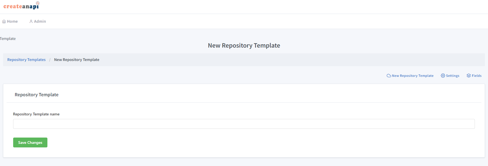
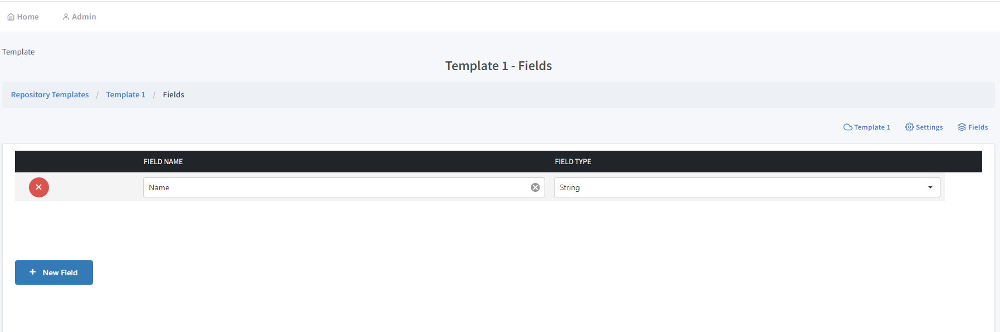

Repository Templates
==================================

Repository templates are predefined templates that keeps a shared field list to be used and managed in a shared manner.

New Repository Template
--------------------------

You can create a new repository template in CreateAnAPI Admin.

Repository Template Name
""""""""""""""""""""""""""""

Repository template names are only used for users to identify the repository, it does not have any programatic impact and can be changed at any moment.

Repository Template Fields
---------------------------

Any field that needs to be queried or aggregated should be included in the field definitions of a repository.

There are 6 types of fields that are currently supported. ``Integer``, ``String``, ``Decimal``, ``Bool``, ``DateTime``, ``Tags (array of strings)``.

You can also set nested fields like ``parent.child`` to be queried.

Fields are only required for query operations, data can have other fields than the definition, however additional fields cannot be queried until they are defined in the data.

.. Attention:: If you decide to change or add a new field after the repository contains data, for the fields that needs to be parsed ( ``Integer``, ``Decimal``, ``Bool``, ``DateTime`` ), you might need to update the old data to include them in the queries.

Defined fields will also be available on CreateAnAPI Admin - Repository page as columns.