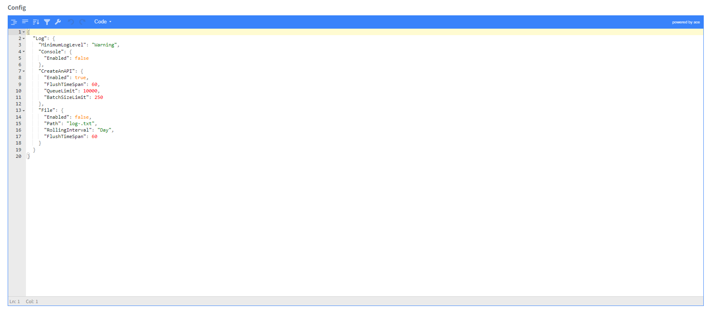

Task Config
==============

The tasks configs are a way to override published tasks appconfig.json file from admin.

Task Config Priorities
""""""""""""""""""""""""

1. Environment Variables with ``CAA_`` prefix"
2. Admin Config
3. ``secrets.json``
4. ``appsettings.{Environment}.json``
5. ``appsettings.json``

This means that appsettings.json will provide the base config and from there, every other config source will override the last one. Environment variables will override any previous value.