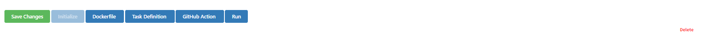

Task Deployment
===============

In order to continue with the deployment, the Solution Name, Project Name, Dockerfile Name and shortcode should be entered and the task should be initialized.
The Dockerfile, Task definition and GitHub Action buttons will be available after initializing the task.

      
  
Project Hierarchy

   |  - .github
   |     - workflows
   |        - {{GITHUB_ACTION}}
   |  - {{DOCKERFILE}}
   |  - src
   |     - {{SOLUTION_NAME}}
   |        - {{PROJECT_NAME}}
   |           - {{TASK_DEFINITION}}