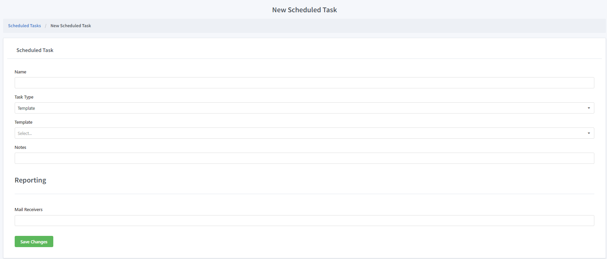

New Task
==============

Name
""""""""""""

The name of the task. It is not used in a programmatic process. Can be changed at any moment.

Task Type
""""""""""""

There are two types of tasks, ``Custom`` and ``Template`` . 
If the source code of the task is created for a specific account, the task type should be custom and deployment steps must be followed.
If the source code of the task is shared between multiple accounts, the task type should be template. No deployment needed.

Template
""""""""""""

Only available if task type is ``Template``.

Notes
""""""""""""

Internal notes. It is not used in a programmatic process. Can be changed at any moment.

Mail Receivers
""""""""""""""

Comma seperated mail address list to notify when task has any errors, or the logs of the tasks have any ``Fatal``, ``Error`` or ``Warning`` logs.