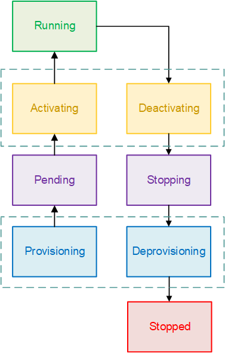

Process
==============

.. image:: images/process-1.png
   :width: 600

The processes represents a single run of a given task. 

Start Date
""""""""""

The UTC date of the tasks start date.

End Date
""""""""""

The UTC date of the tasks end date.

Duration
""""""""""

The duration of the process. Only available after process ends.

Health
""""""""""

The health of the process.

Available values:

* ``Created``
* ``Success``
* ``Error``

Memory
""""""""

The memory of the task instance.

CPU
""""

The cpu of the task instance

Static IP
""""""""""

If the task instance run from a static ip or not.

Last Status
""""""""""""

Last known AWS status of the task instance.

Stopped Reason
""""""""""""""""
Below, you can find some of the most common stopped reasons from AWS.

* Essential container exited
     * Most common response for tasks. Usualy it means the task stopped on its own. There is no problem if the process health is ``Success``. If the process health is still ``Created``, there might be a resource deficiency (memory or cpu) in the task.
* Underlying infrastructure maintenance
     * AWS Maintenance is active
* ResourceInitializationError
     * Unable to pull secrets or registry auth: execution resource retrieval failed
* CannotPullContainerError
     * Most commonly received when the GitHub Action is never runned and the AWS does not have a docker image to publish. 
* Task stopped by user
     * Task is stopped by the user via AWS Dashboard.

Environment Variables
""""""""""""""""""""""

Environment variable key-value pairs of the task instance.