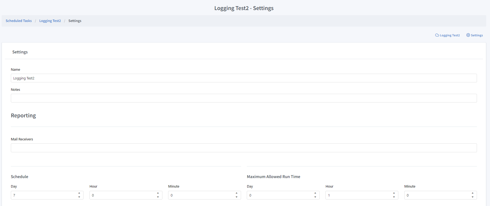
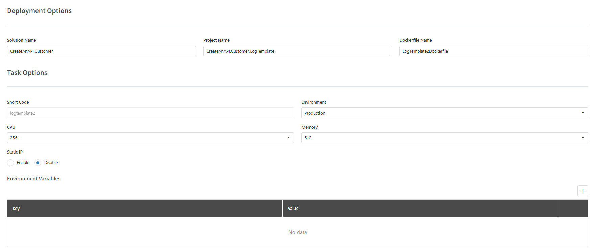

Task Settings
==============

   
Name
""""""""""""

The name of the task. It is not used in a programmatic process. Can be changed at any moment.

Notes
""""""""""""

Internal notes. It is not used in a programmatic process. Can be changed at any moment.

Mail Receivers
""""""""""""""

Comma seperated mail address list to notify when task has any errors, or the logs of the tasks have any ``Fatal``, ``Error`` or ``Warning`` logs.

Schedule
""""""""""""""

The schedule of the task based on the timespan. Task will run every selected timespan if enabled.

Maximum Allowed Run Time
""""""""""""""""""""""""

Maximum timespan which the task is allowed to run. Only effective after a single process does not finish within given schedule.
For example, if a task scheduled hourly and the process takes more than an hour, this value determines how long should system allow the process to run.
After maximum timespan passed, the task will be force stopped and a new instance of the task will start.

   
Solution Name
""""""""""""""

Only available for ``Custom`` tasks. The name of the dotnet solution. 

Project Name
""""""""""""""

Only available for ``Custom`` tasks. The name of the dotnet project. 

Dockerfile Name
""""""""""""""""

Only available for ``Custom`` tasks. The name of the project dockerfile. 

Short Code
""""""""""""""

Only available for ``Custom`` tasks. The shortcode of the project. Should be unique for each account.

Environment
""""""""""""""

Only available for ``Custom`` tasks. The runtime environment of the project. Practicaly, this will determine the appsettings to use.

CPU
""""""""""""""

Allocated CPU for the task instance. Use 256 as default.

Memory
""""""""""""""

Allocated Memory for the task instance. Use 2048 as default.

Static IP
""""""""""""""

Determines if the task instance will use the static ip nat gateway for outbound requests. Use only when the target resource requires ip whitelisting.
For example accessing databases, ftp servers etc.

Use ``3.15.63.209`` for ip whitelists.

Environment Variables
""""""""""""""""""""""

Key value pairs that will be injected in the task instance.

